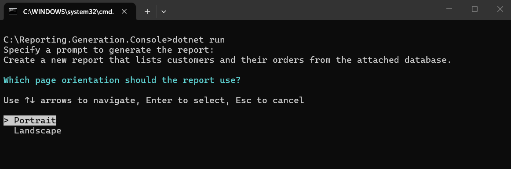
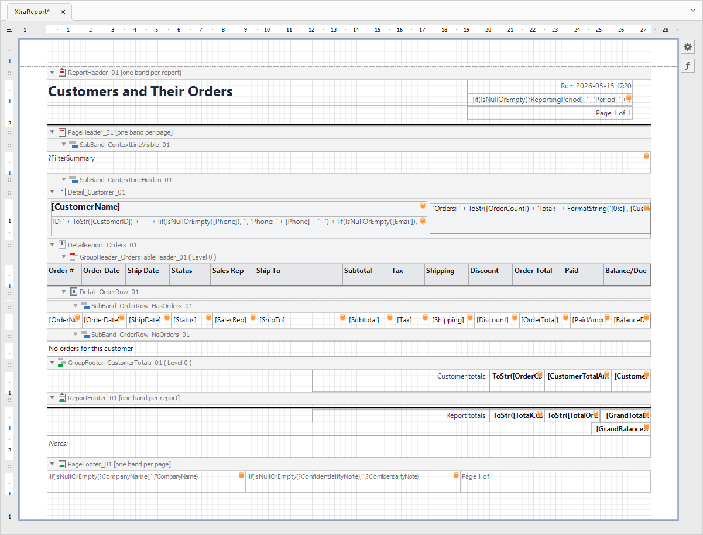

<!-- default badges list -->

[](https://supportcenter.devexpress.com/ticket/details/T1329011)
[](https://docs.devexpress.com/GeneralInformation/403183)
[](#does-this-example-address-your-development-requirementsobjectives)
<!-- default badges end -->
# DevExpress Reports - Generate a Report Based on a User Prompt Within a Console App

This example integrates multi-agent report generation for a .NET 8 console application using Azure OpenAI.



The generated report is saved to the *generatedReport.repx* file.


    
## Prerequisites

* .NET 8 SDK
* Azure OpenAI
* The following NuGet packages should be installed in your project:
  * [`DevExpress.AIIntegration.Reporting.Common`](https://www.nuget.org/packages/DevExpress.AIIntegration.Reporting.Common/)
  * [`Azure.AI.OpenAI`](https://www.nuget.org/packages/Azure.AI.OpenAI/)
  * [`Microsoft.Extensions.AI`](https://www.nuget.org/packages/Microsoft.Extensions.AI/)
  
## Implementation Details 

To implement report generation in your application, you must:

1. Create an `IChatClient` instance for your AI provider:

    ```cs
    // Retrieve the Azure OpenAI endpoint, key, and model from user environment variables.
    string endpoint = Environment.GetEnvironmentVariable("AZURE_OPENAI_ENDPOINT", EnvironmentVariableTarget.User)
        ?? throw new InvalidOperationException("AZURE_OPENAI_ENDPOINT is not set.");
    string apiKey = Environment.GetEnvironmentVariable("AZURE_OPENAI_API_KEY", EnvironmentVariableTarget.User)
        ?? throw new InvalidOperationException("AZURE_OPENAI_API_KEY is not set.");
    string deploymentName = Environment.GetEnvironmentVariable("AZURE_OPENAI_DEPLOYMENT", EnvironmentVariableTarget.User)
        ?? "gpt-5-mini";
    // Create an Azure OpenAI client to work with the chat agent.
    IChatClient chatClient = new AzureOpenAIClient(new Uri(endpoint), new ApiKeyCredential(apiKey))
        .GetChatClient(deploymentName)
        .AsIChatClient();
    ```

    For additional information, refer to the following help topic: [AI-powered Extensions — Register AI Clients](https://docs.devexpress.com/CoreLibraries/405204/ai-powered-extensions#register-ai-clients).
    

2. Initialize an AI extensions container to register the AI client and reporting extension:

    ```cs
    using DevExpress.AIIntegration.Reporting.Common.Extensions;
    using DevExpress.AIIntegration;
    //
    AIExtensionsContainerDefault container = AIExtensionsContainerConsole.CreateDefaultAIExtensionContainer(chatClient);
    container.RegisterReportingExtensions();
    ```

3. Create a class that implements [`IAIReportGenerationHost`](https://docs.devexpress.com/XtraReports/DevExpress.AIIntegration.Reporting.IAIReportGenerationHost) to handle clarification questions and to show progress/notifications:

    Implement and supply a host for interactive workflows ([ConsoleAIReportGenerationHost.cs](CS/Reporting.Generation.Console/ConsoleAIReportGenerationHost.cs)).

    ```cs
    namespace Reporting.Generation.Console {
        public class ConsoleAIReportGenerationHost : IAIReportGenerationHost {
            private string lastStatus = string.Empty;

            public Task<PromptClarificationAnswer> ClarifyPromptAsync(PromptClarificationQuestion request) {
                // Render the request in your UI (request.Text and request.Choices).
                // Return PromptClarificationAnswer.FromValue(selectedChoice).

                // Return PromptClarificationAnswer.Canceled() if the user cancels the operation.
                return Task.FromResult(PromptClarificationAnswer.Canceled());
            }

            public void NotifyAsync(string status, string reasoning) {
                bool isNewStatus = lastStatus != status;
                lastStatus = status;

                // Surface progress to users (console, logger, status bar, web socket, etc.).
                // Update the status when isNewStatus is true; otherwise refresh the reasoning only.
            }
        }
    }
    ```

4. Generate the report from a prompt.

    In the [Program.cs](CS/Reporting.Generation.Console/Program.cs) file, create a [`PromptToReportRequest`](https://docs.devexpress.com/XtraReports/DevExpress.AIIntegration.Reporting.Common.Extensions.PromptToReportRequest) instance with the user prompt, assign the host, and specify additional settings. Call [`AIReportingIntegration.GeneratePromptToReportAsync`](https://docs.devexpress.com/XtraReports/DevExpress.AIIntegration.AIReportingIntegration.GeneratePromptToReportAsync(IAIExtensionsContainer--PromptToReportRequest--CancellationToken)) to obtain an [`XtraReport`](https://docs.devexpress.com/XtraReports/DevExpress.XtraReports.UI.XtraReport) instance.

    ```cs
    using Reporting.Generation.Console;
    using DevExpress.AIIntegration.Reporting.Common.Extensions;
    using DevExpress.XtraReports.UI;
    // ...
    // Ask the user for a report description in natural language.
    Console.WriteLine("Specify a prompt to generate the report:");
    string prompt = Console.ReadLine();
    try {
        // Create a host to handle clarification questions and progress notifications.
        ConsoleAIReportGenerationHost host = new ConsoleAIReportGenerationHost();
        // Build a generation request from the user prompt.
        PromptToReportRequest generationRequest = new PromptToReportRequest(userPrompt: prompt, dataSourceSchema: null, report: null) {
            ReportGenerationHost = host,
            FixLayoutErrors = true
        };
        // Generate a report layout and save it to a REPX file.
        XtraReport report = await container.GeneratePromptToReportAsync(generationRequest, default);
        report.SaveLayoutToXml("generatedReport.repx");
    } catch (Exception ex) {
        Console.WriteLine($"Report generation failed: {ex.Message}");
    }
    ```


## Files to Review

- [ConsoleAIReportGenerationHost.cs](CS/Reporting.Generation.Console/ConsoleAIReportGenerationHost.cs)/(VB: [ConsoleAIReportGenerationHost.vb](VB/Reporting.Generation.Console/ConsoleAIReportGenerationHost.vb))
- [Program.cs](CS/Reporting.Generation.Console/Program.cs)/(VB: [Program.vb](VB/Reporting.Generation.Console/Program.vb))

## Documentation

- [PromptToReportRequest Class](https://docs.devexpress.com/XtraReports/DevExpress.AIIntegration.Reporting.Common.Extensions.PromptToReportRequest)
- [IAIReportGenerationHost Interface](https://docs.devexpress.com/XtraReports/DevExpress.AIIntegration.Reporting.IAIReportGenerationHost)
- [PromptClarificationQuestion Class](https://docs.devexpress.com/XtraReports/DevExpress.AIIntegration.Reporting.PromptClarificationQuestion)
- [PromptClarificationAnswer Class](https://docs.devexpress.com/XtraReports/DevExpress.AIIntegration.Reporting.PromptClarificationAnswer)

<!-- feedback -->
## Does This Example Address Your Development Requirements/Objectives?

[](https://www.devexpress.com/support/examples/survey.xml?utm_source=github&utm_campaign=ai-powered-report-generation-in-console&~~~was_helpful=yes) [](https://www.devexpress.com/support/examples/survey.xml?utm_source=github&utm_campaign=ai-powered-report-generation-in-console&~~~was_helpful=no)

(you will be redirected to DevExpress.com to submit your response)
<!-- feedback end -->
